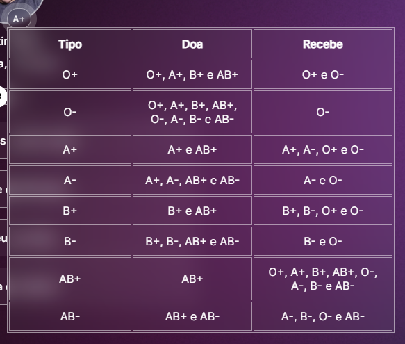

<h1 align="center"> DevLinks </h1>

Programa exclusivo e gratuito, promovido pela Rocketseat para ensino de tecnologias WEB.  
<a href="https://lp.rocketseat.com.br/devlinks/inscricao?utm_source=github&utm_medium=descricao&utm_campaign=capture-devlinks&utm_term=organic&utm_content=descricao-github-mayk-brito">Estude esse projeto em formato de vídeo clicando aqui.</a>

  <a href="#-tecnologias">Tecnologias</a>&nbsp;&nbsp;&nbsp;|&nbsp;&nbsp;&nbsp;
  <a href="#-projeto">Projeto</a>&nbsp;&nbsp;&nbsp;|&nbsp;&nbsp;&nbsp;
  <a href="#-layout">Layout</a>&nbsp;&nbsp;&nbsp;|&nbsp;&nbsp;&nbsp;
  <a href="#-aprendizado">Aprendizado</a>&nbsp;&nbsp;&nbsp;|&nbsp;&nbsp;&nbsp;
  <a href="#-crescimento">Crescimento</a>&nbsp;&nbsp;&nbsp;|&nbsp;&nbsp;&nbsp;
  <a href="#memo-licença">Licença</a>
  

  

 

  

## 🚀 Tecnologias

Esse projeto foi desenvolvido com as seguintes tecnologias:

-   ⛛. HTML e CSS
-   ⛛. JavaScript
-   ⛛. Git e Github
-   ⛛. Figma

## 💻 Projeto

O DevLinks é um agregador de links para usar como cartão de visitas online.

-   [Acesse o projeto finalizado, online](https://letimberg.github.io/informationlinks/)

-   [Assistir aulas](https://lp.rocketseat.com.br/devlinks/inscricao?utm_source=github&utm_medium=descricao&utm_campaign=capture-devlinks&utm_term=organic&utm_content=descricao-github-mayk-brito)

## 🔖 Layout

Você pode visualizar o layout do projeto através [DESSE LINK](https://www.figma.com/community/file/1187422022288947321). É necessário ter conta no [Figma](https://figma.com) para acessá-lo.

## 📚 Aprendizado

Neste projeto, adquiri conhecimento sobre o uso da função "toggle". Com essa função, é possível refatorar o código de forma a reduzir a necessidade de utilizar estruturas condicionais do tipo IF / ELSE.

Trecho código IF /ELSE

<pre>
  const html = document.documentElement

  if (html.classList.contains("light")) {
      html.classList.remove("light")
  } else {
      html.classList.add("light")
  }
</pre>

Código refatorado com a função toggle

<pre>
  const html = document.documentElement
  
  html.classList.toggle("light")
</pre>

## 📊 Crescimento

Após a conclusão do projeto, um desafio é lançado visando o crescimento e a busca pelo próximo nível.

#### Nesse sentido, foram implementadas as seguintes melhorias:

-   Foi adicionado um botão com a informação do tipo sanguíneo.
-   Uma tabela informativa sobre as doações sanguíneas foi criada, esclarecendo quem pode doar para quem.
-   Além disso, foi desenvolvida uma funcionalidade de "mouseover" e "mouseout", que ao passar o mouse sobre o botão tipo sanguíneo, a tabela que detalha as doações sanguíneas é exibida.

    

## :memo: Licença

Esse projeto está sob a licença MIT.

---

Feito com ♥ by Rocketseat :wave: [Participe da nossa comunidade!](https://discord.gg/rocketseat)
